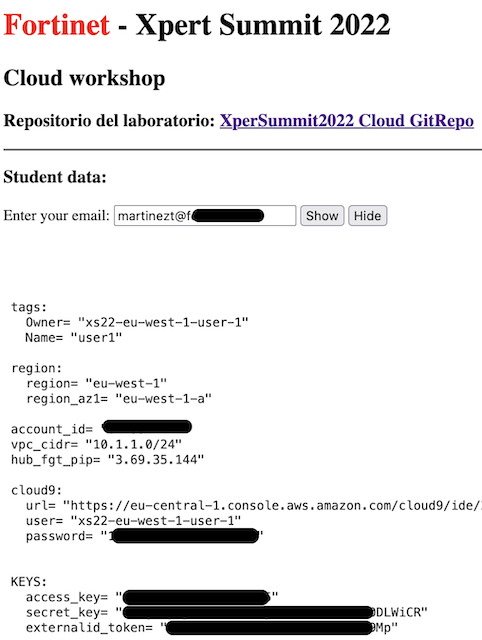
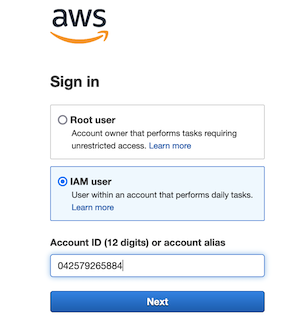
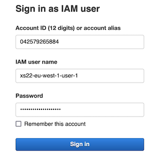
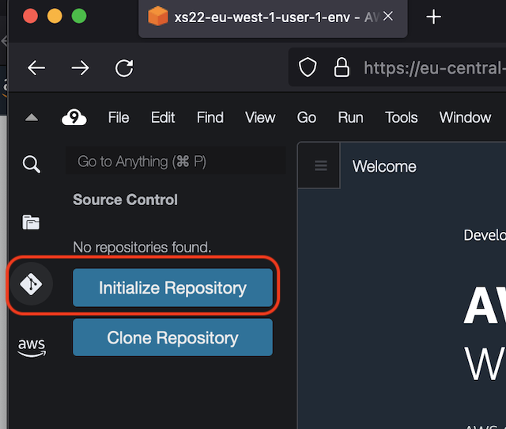
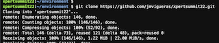

# Xpert Summit 2022 - Automation Cloud training
## Objetivo del laboratorio
El objetivo de este laboritorio es dar nociones sobre como desplegar una infraestructura relativamente compleja de hub y spoke en AWS. Además de dar idea de cómo poder operar un firewall Fortigate a través de su API. Durante el laboratio te familizaras con el entorno Terraform y como lanzar y customizar los despligues. 

El formato del laboratorio consiste en 4 entrenamiento diferenciados, que van desde el despliegue básico de un servidor de test y el Fortigate a realizar la configuración ADVPN para poder establecer conexión el HUB central, llamado Golden VPC. 

Los detalles necesarios para poder realizar el curso se encuentra en: 
http://xpertsummit22.jvigueras-fortinet-site.com

## Indice de entramientos a completar
* **T1_day0_deploy-vpc**: despliegue del entorno básico en AWS
* T2_day0_deploy-server: despliegue del servidor de test en spoke
* T3_day0_deploy-fgt: despligue de Fortigate standalone en region AZ1
* T4_dayN_fgt-terraform: actualiación de configuraicón del Fortigate mediante Terraform

## Deployment Overview

En este entrenamiento inicial se desplegarán los siguientes recursos:
- 1 VPC para cada uno de los alumnos
- 4 subnets en dicha VPC: Management, Public, Private y Servers
- Security groups
- Network interfaces para el Fortigate y el servidor

## Diagram solution


## Pasos a seguir:

# 1. Conexión al entorno de desarrollo Cloud9
Desde el  podeis encontrar el acceso a vuestro entorno Cloud9.

1.1 Obtener los datos de cada usuario
- Desde el portal de formación introducir el email de registro al curso.
- Acceder a la URL del portal Cloud9 con los datos de usuario user_id y user_password.



- Ejemplo:
  - URL acceso: https://eu-central-1.console.aws.amazon.com/cloud9/ide/c93257xxxxxxxxx
  - User: xs22-eu-west-1-user-1
  - Password: xxxxx






# 2. Clonar repositorio Git
- Desde el terminal ejecutar el siguiente comando: 
```
git clone https://github.com/jmvigueras/xpersummit22/student-training
```
- ... o desde el botón de Git que se puede encontrar e introduciendo la URL anterior





# 3.  Acceder a la carpeta T1_day0_deploy-vpc
- Desde el terminal 
```
cd T1_day0_deploy-vpc
```
- Desde el navegador de ficheros de la parte izquierda desdplegando la carpeta corrspondiente al T1

* 4. **IMPORTANTE** Actualizar las variables necesarias para este primer laboratorio
- Esta será la única vez que será necesario actualizar estas variables.
- Se debe actualizar de forma con los datos de cada participante para poder completar el lab
- Los datos se deben de obtinen desde el 
- Hacer doble click en el fichero **UPDATE-vars.tf** desde el explorador de ficheros.
- Actualizar las siguientes variables con los datos de cada participante.
```
// IMPORTANT: UPDATE Owner with your AWS IAM user name
variable "tags" {
  description = "Attribute for tag Enviroment"
  type = map(any)
  default     = {
    Owner   = "xs22-eu-west-1-user-1"   //update with your assigned user for access AWS console
    Name    = "user-1"                  //update with your assigned user name
    Project = "xs22"                    
  }
}
// Region and Availability Zone where deploy VPC and Subnets
variable "region" {
  type = map(any)
  default = {
    "region"     = "eu-west-1"   //update with your assigned region
    "region_az1" = "eu-west-1a"  //update with your assigned AZ
  }
}
// CIDR range to use for your VCP: 10.1.x.x group 1 - 10.1.1.0/24 user-1
variable "vpc-spoke_cidr"{
  type    = string
  default = "10.1.1.0/24"   //update with your assigned cidr
}
```


* 5. **IMPORTANTE** Actualizar las credenciales de acceso programático que usuará Terraform para el despliegue
- Hacer doble click en el fichero **terraform.tfvars.example.tf** desde el explorador de ficheros.
- Actualizar las variables con los datos proporcionados en el  
```
access_key          = "<AWS Access Key>"
secret_key          = "<AWS Secret Key>"
externalid_token    = "<ExternalID token>"
```
- Las variables deben quedar configuradas con el siguiente patrón: access_key="AZXSxxxxxx"
- Cambiar el nombre al fichero `terraform.tfvars.example` a `terraform.tfvars`

* 6. Revisión de la estructura y de los diferentes ficheros (NO ES NECESARIO REALIZAR NINGUNA CONFIGURACIÓN ADICIONAL)

* 7. **Despligue** 

* Inicialización de providers y modulos:
  ```sh
  $ terraform init
  ```
* Crear un plan de despliegue y 
  ```sh
  $ terraform plan
  ```
* Comprobación que toda la configuración es correcta y no hay fallos.
* Desplegar el plan.
  ```sh
  $ terraform apply
  ```
* Confirmar despligue, type `yes`.
* Si todo funciona correctamente se generará una salida con el resumen del plan de despligue y las variables de output configuradas:


# Support
This a personal repository with goal of testing and demo Fortinet solutions on the Cloud. No support is provided and must be used by your own responsability. Cloud Providers will charge for this deployments, please take it in count before proceed.

## License
Based on Fortinet repositories with original [License](https://github.com/fortinet/fortigate-terraform-deploy/blob/master/LICENSE) © Fortinet Technologies. All rights reserved.


