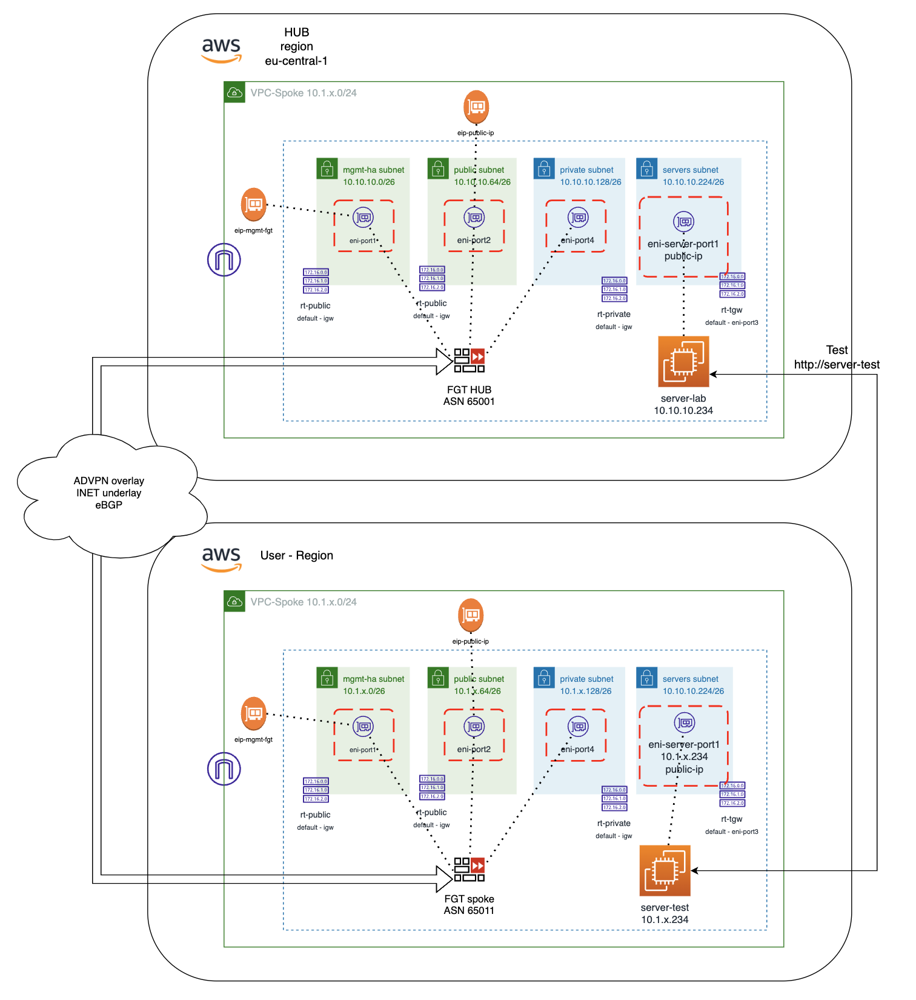
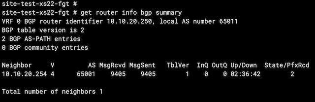

# Xpert Summit 2022 - Automation Cloud training
## Objetivo del laboratorio
El objetivo de este laboritorio es dar nociones sobre como desplegar una infraestructura relativamente compleja de hub y spoke en AWS. Además de dar idea de cómo poder operar un firewall Fortigate a través de su API. Durante el laboratio te familizaras con el entorno Terraform y como lanzar y customizar los despligues. 

El formato del laboratorio consiste en 4 entrenamiento diferenciados, que van desde el despliegue básico de un servidor de test y el Fortigate a realizar la configuración ADVPN para poder establecer conexión el HUB central, llamado Golden VPC. 

Los detalles necesarios para poder realizar el curso se encuentra en: 
http://xpertsummit22.jvigueras-fortinet-site.com

## Indice de entramientos a completar
* T1_day0_deploy-vpc: despliegue del entorno básico en AWS
* T2_day0_deploy-server: despliegue del servidor de test en spoke
* T3_day0_deploy-fgt: despligue de Fortigate standalone en region AZ1
* **T4_dayN_fgt-terraform**: actualiación de configuraicón del Fortigate mediante Terraform

## Deployment Overview

En este entrenamiento realizaremos lo siguiente:
- **IMPORTANTE** se debe haber completado con éxito el laboratorio: T1, T2 y T3
- Las variables necesarias para poder realizar el despliegue de la IaC se recogen de los anteriores entrenamientos.
- Los datos necesarios para poder desplegar la configuración en el equipo se cargan de manera automática.
- Este laboratios a su vez se devido en tres partes:
  - Configuración de túnel IPSEC entre el Fortigate spoke y el Fortigate de la VPC golden
  - Configuración de router BGP para compatización dinámica de rutas entre HUB y SPOKE
  - Configuración de policitas de seguridad para permitir el tráfico entre el serividor central y el servidor de test
- La idea del laboratorio es que se apliquen los cambios de configuración de manera progresiva, cambiando la extensión de los ficheros de Terraform para que cuenten para el plan de despliegue y comprobando como podriamos ir modificando la configuración del Fortigate a través de aquí.


## Diagram solution




## Pasos a seguir:

# 1. Conexión al entorno de desarrollo Cloud9
- (Revisar pasos laboratorio T1)

# 2. Clonar repositorio Git
- (Revisar pasos laboratorio T1)

# 3.  Acceder a la carpeta T4_dayN_fgt-terraform
- Abrir un nuevo terminal y entrar en la carpeta del laboratorio
```
cd T4_dayN_fgt-terraform
```
- Desde el navegador de ficheros de la parte izquierda desplegando la carpeta correspondiente al T4

* 4. **IMPORTANTE** Debes haber completado con éxito el laboratorio T1 para continuar
- Las variables necesarias para este laboratorio se importan del anterior.
- Las credendiales progrmáticas ACCESS_KEY y SECRET_KEY también se importan del lab anterior.
- Cambiar el nombre al fichero `terraform.tfvars.example` a `terraform.tfvars`

* 6. Revisión de la estructura y de los diferentes ficheros (NO ES NECESARIO REALIZAR NINGUNA CONFIGURACIÓN ADICIONAL)

* 7. **Despligue** 

7.1 Creación de nuevo túnel IPSEC ADVPN contra el HUB central
- Cambiamos el nombre del fichero `1_ipsec-to-golden.tf.example` a `1_ipsec-to-golden.tf`
- Inicializamos el proceso de despliegue (revisar punto 8)
- Comprobar desde la GUI del Fortigate el correcto despligue

7.2 Configuración de router BGP
- Cambiamos el nombre del fichero `2_bgp-route.tf.example` a `2_bgp-route.tf`
- Inicializamos el proceso de despliegue (revisar punto 8)
- Comprobaremos que no va a realizar ningún cambio sobre la configuración anterior que hemos desplegado
- Comprobar desde la GUI del Fortigate el correcto despligue

7.3 Configuración de política de seguridad
- Cambiamos el nombre del fichero `3_policy-to-server.tf.example` a `3_policy-to-server.tf`
- Inicializamos el proceso de despliegue (revisar punto 8)
- Comprobaremos que no va a realizar ningún cambio sobre la configuración anterior que hemos desplegado
- Comprobar desde la GUI del Fortigate el correcto despligue

7.4 Comprobación de conectividad a HUB
- Comprobación de la correcta conexión al HUB (Golden VPC)
```
get router info bgp summary
get router info routing-table bgp
get router info bgp neighbors 10.10.20.254 ad
get router info bgp neighbors 10.10.20.254 ro

diagnose sniffer packet any '<host IPServidor>' 4
```



* 8. Comandos Terraform para despliegue

* Inicialización de providers y modulos:
  ```sh
  $ terraform init
  ```
* Crear un plan de despliegue y 
  ```sh
  $ terraform plan
  ```
* Comprobación que toda la configuración es correcta y no hay fallos.
* Desplegar el plan.
  ```sh
  $ terraform apply
  ```
* Confirmar despligue, type `yes`.


Output will include the information necessary to log in to the FortiGate-VM instances:
```sh
Outputs:


# Support
This a personal repository with goal of testing and demo Fortinet solutions on the Cloud. No support is provided and must be used by your own responsability. Cloud Providers will charge for this deployments, please take it in count before proceed.

## License
Based on Fortinet repositories with original [License](https://github.com/fortinet/fortigate-terraform-deploy/blob/master/LICENSE) © Fortinet Technologies. All rights reserved.


